# Bab III — Perancangan Sistem
## Web-to-Print Editor (SaaS Sampul Rapor)

---

## 3.1 Flowchart Alur Sistem

Berikut adalah alur kerja utama sistem dari pengguna pertama kali membuka aplikasi hingga proyek desain selesai.

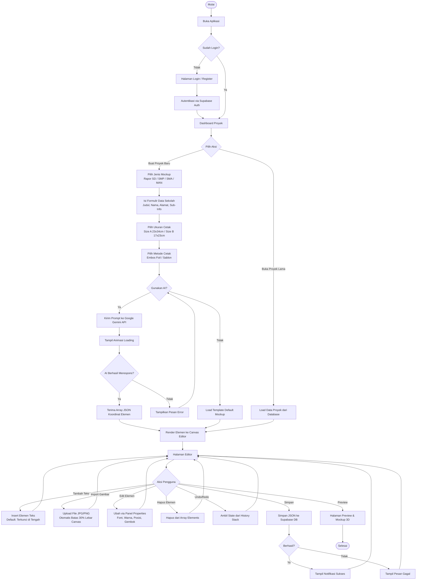

---

## 3.12 Perancangan Sistem

### 3.12.1 Use Case Diagram

Diagram berikut menggambarkan interaksi antara aktor (Pengguna) dengan fungsionalitas yang tersedia dalam sistem.

**Aktor:**
- **Pengguna** — Operator percetakan atau klien sekolah yang menggunakan aplikasi
- **Sistem AI** — Google Gemini API yang dipanggil sebagai layanan eksternal

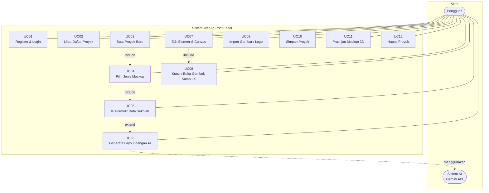

| Kode | Nama Use Case | Aktor | Deskripsi |
|---|---|---|---|
| UC01 | Register & Login | Pengguna | Mendaftar akun baru atau masuk menggunakan email dan kata sandi |
| UC02 | Lihat Daftar Proyek | Pengguna | Melihat semua proyek milik pengguna di halaman dashboard |
| UC03 | Buat Proyek Baru | Pengguna | Memulai sesi pembuatan desain baru |
| UC04 | Pilih Jenis Mockup | Pengguna | Memilih jenis rapor (SD, SMP, SMA, MAN) sebelum mengisi data |
| UC05 | Isi Formulir Data Sekolah | Pengguna | Memasukkan teks konten: judul, nama, alamat, dan sub-informasi |
| UC06 | Generate Layout dengan AI | Pengguna, Sistem AI | Mengirim data ke Gemini API untuk mendapatkan tata letak otomatis |
| UC07 | Edit Elemen di Canvas | Pengguna | Memanipulasi elemen (drag, ubah teks, ubah warna, resize) |
| UC08 | Kunci / Buka Gembok Sumbu X | Pengguna | Mengunci atau membebaskan posisi horizontal suatu elemen |
| UC09 | Import Gambar / Logo | Pengguna | Mengunggah gambar eksternal (logo sekolah) ke dalam kanvas |
| UC10 | Simpan Proyek | Pengguna | Menyimpan state kanvas ke database Supabase |
| UC11 | Pratinjau Mockup 3D | Pengguna | Membuka halaman pratinjau dengan efek tiga dimensi |
| UC12 | Hapus Proyek | Pengguna | Menghapus proyek yang tidak dibutuhkan dari dashboard |

---

### 3.12.2 Activity Diagram

Berikut adalah activity diagram yang dibuat secara terpisah untuk setiap fitur utama dalam sistem.

---

#### AD-01: Register dan Login

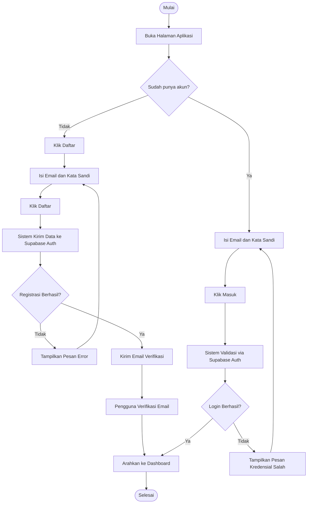

---

#### AD-02: Membuat Proyek Baru

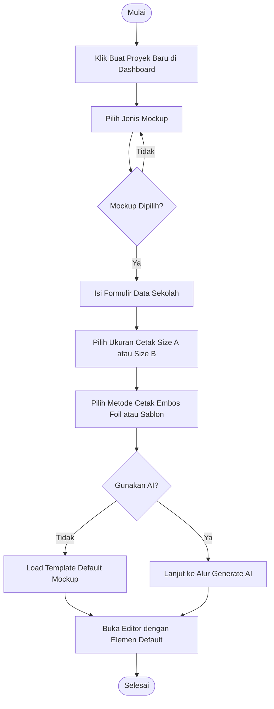

---

#### AD-03: Generate Layout dengan AI

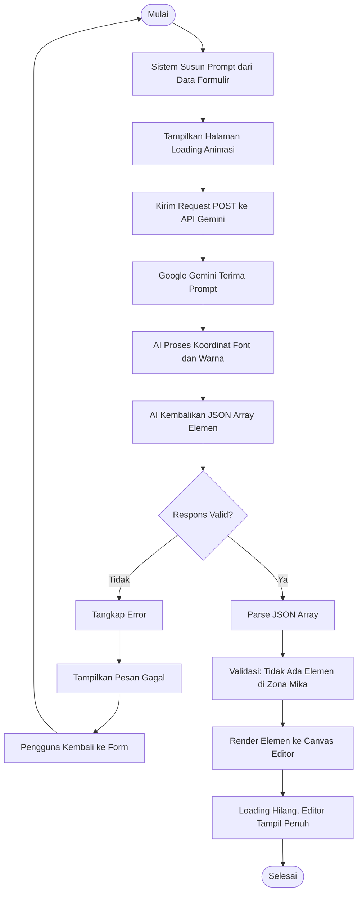

---

#### AD-04: Penggunaan Editor Canvas

Diagram ini mencakup seluruh interaksi pengguna di dalam halaman Editor, termasuk penambahan elemen, manipulasi properti, pengaturan posisi, validasi zona mika, undo/redo, dan penyimpanan proyek.

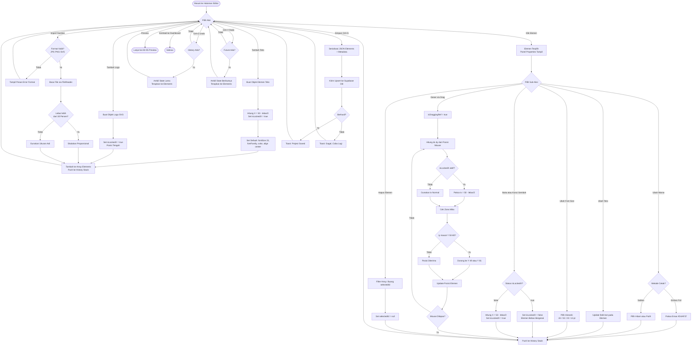

---

#### AD-05: Pratinjau Mockup 3D

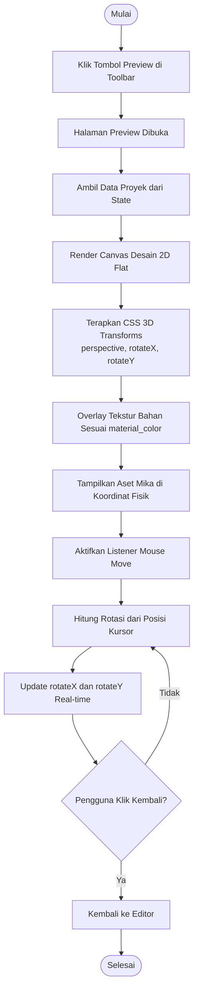

---

#### AD-06: Menghapus Proyek dari Dashboard


---


    B -- Drag ke Canvas --> C[Event Drop Terdeteksi]
    B -- Klik Tombol Import --> D[Buka Dialog File]
    D --> E[Pengguna Pilih File]
    E --> C
    C --> F{Format Valid JPG PNG SVG?}
    F -- Tidak --> G[Tampilkan Pesan Error Format]
    G --> A
    F -- Ya --> H[Baca File via FileReader API]
    H --> I[Hitung Dimensi Gambar]
    I --> J{Lebar lebih dari 30 persen Canvas?}
    J -- Ya --> K[Skalakan Proporsional Maks 30 Persen]
    J -- Tidak --> L[Gunakan Ukuran Asli]
    K --> M[Set isLockedX = true, Posisi Tengah]
    L --> M
    M --> N[Tambah ke Array Elements sebagai type image]
    N --> O[Push ke History Stack]
    O --> P[Gambar Muncul di Canvas]
    P --> Q([Selesai])
```

---

#### AD-06: Mengedit Konten Teks

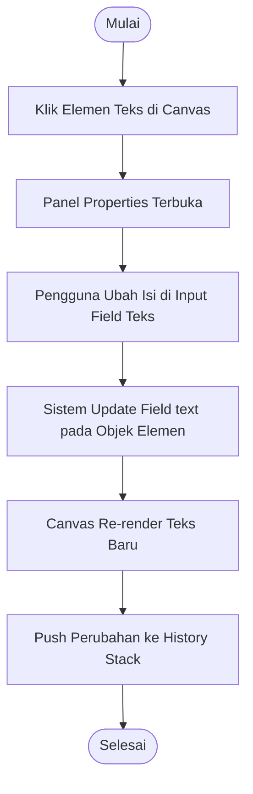

---

#### AD-07: Mengubah Ukuran Font

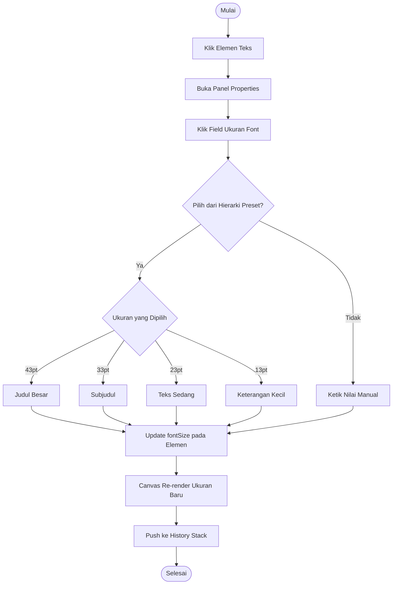

---

#### AD-08: Mengubah Warna Elemen

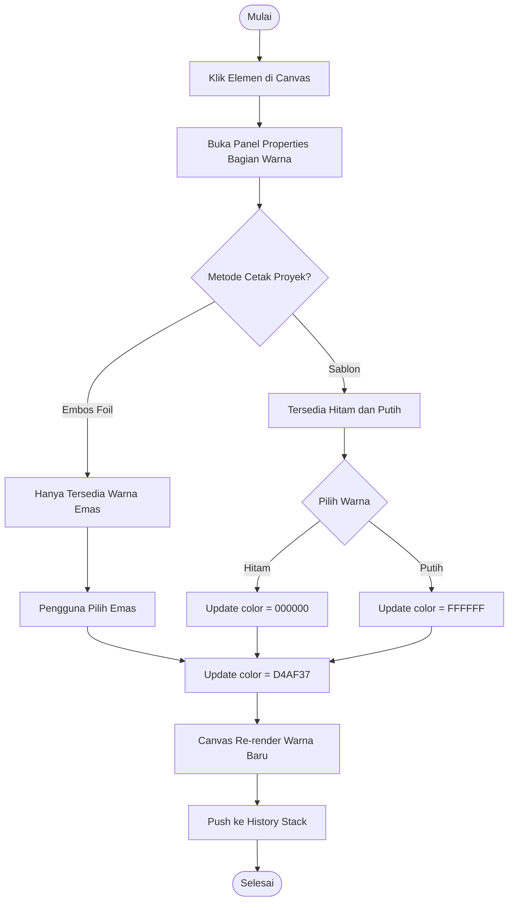

---

#### AD-09: Kunci dan Buka Gembok Sumbu X

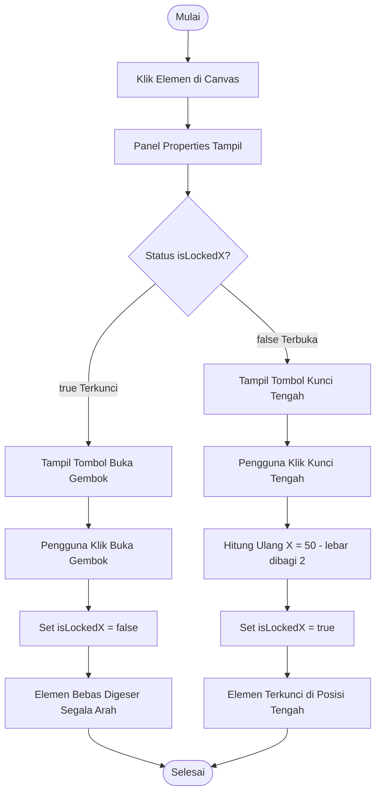

---

#### AD-10: Menggeser Elemen dengan Drag

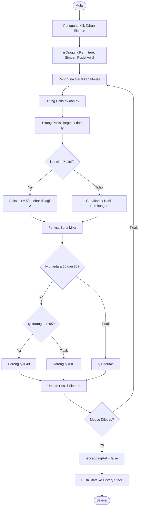

---

#### AD-11: Undo dan Redo

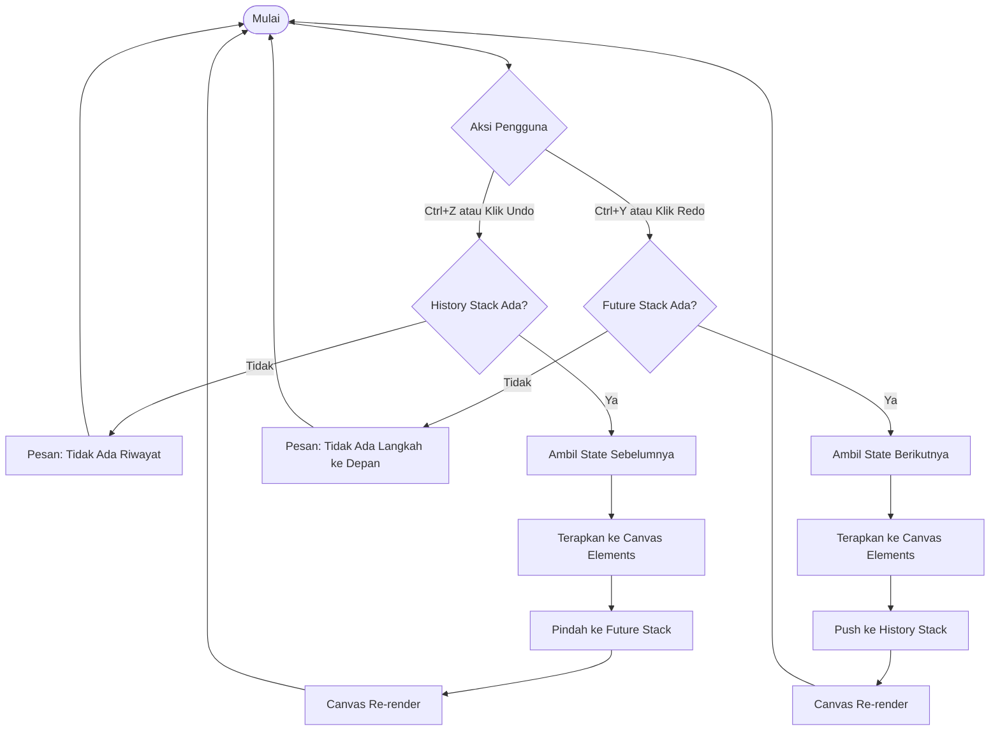

---

#### AD-12: Menyimpan Proyek

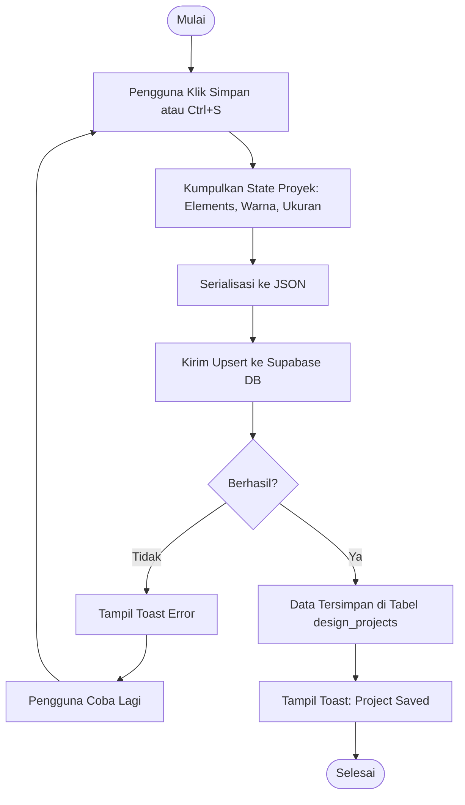

---

#### AD-13: Menghapus Elemen di Canvas

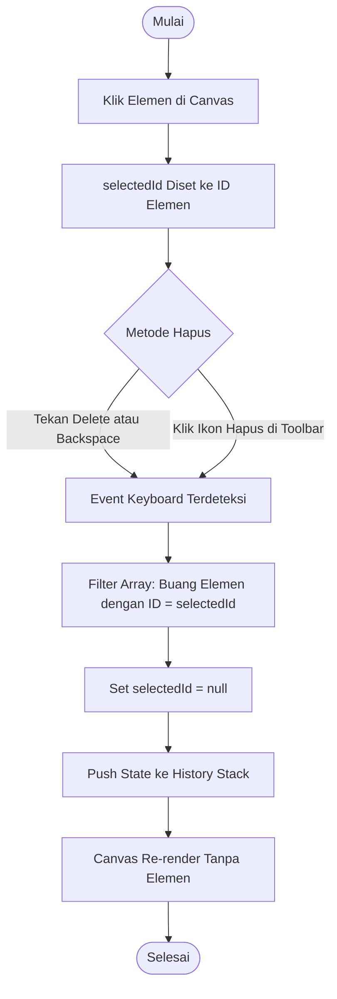

---

#### AD-14: Pratinjau Mockup 3D

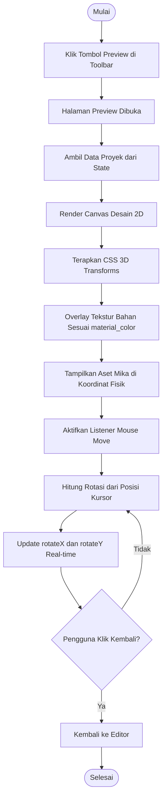

---

#### AD-15: Menghapus Proyek dari Dashboard

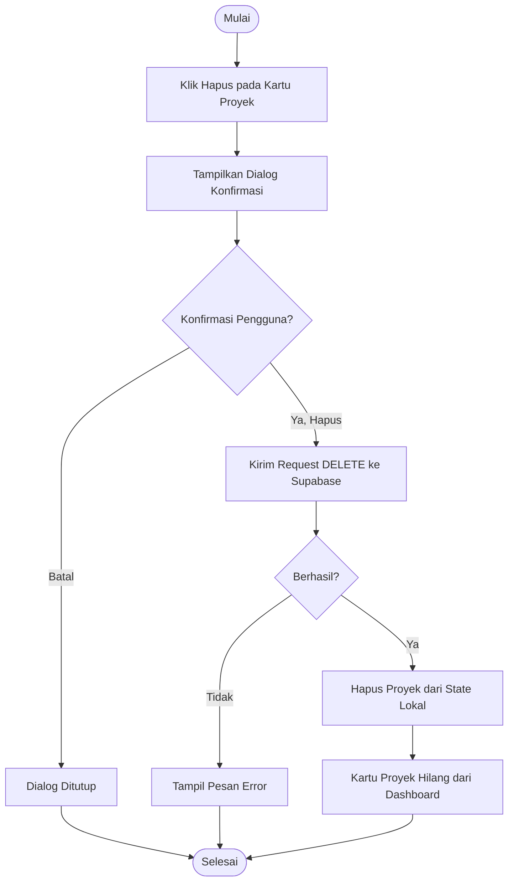


---

## 3.13 Perancangan Database

### 3.13.1 Entity Relationship Diagram (ERD)

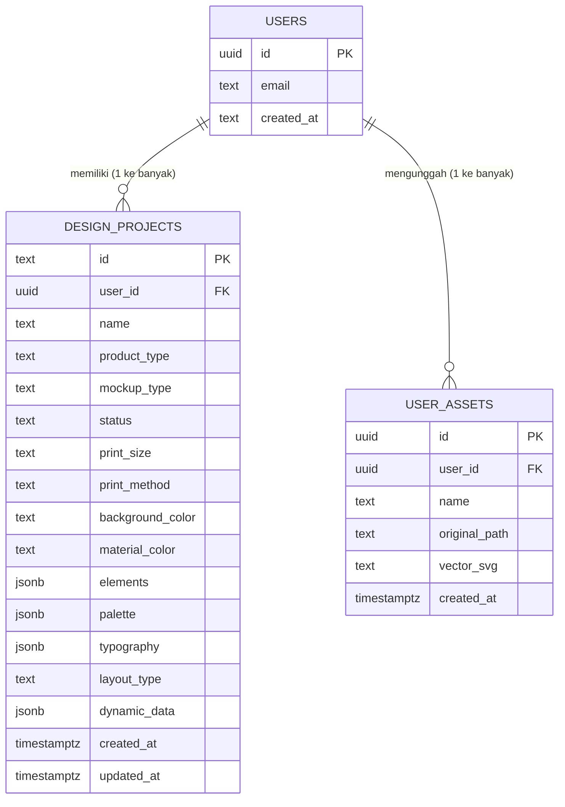

---

### 3.13.2 Entity Relationship Table

#### Tabel `design_projects`

| Nama Kolom | Tipe Data | Constraint | Keterangan |
|---|---|---|---|
| id | TEXT | PRIMARY KEY | ID unik proyek |
| user_id | UUID | NOT NULL, FK → auth.users(id) | Pemilik proyek; CASCADE DELETE |
| name | TEXT | NOT NULL | Nama proyek desain |
| product_type | TEXT | NOT NULL, DEFAULT 'Sampul Rapor' | Kategori produk cetak |
| mockup_type | TEXT | NULL | Jenis rapor (SD, SMP, SMA, MAN) |
| status | TEXT | CHECK (Draft/Final/Selesai) | Status pengerjaan proyek |
| print_size | TEXT | NULL | Ukuran kertas cetak (A atau B) |
| print_method | TEXT | NULL | Metode cetak (Embos Foil / Sablon) |
| background_color | TEXT | DEFAULT '#1E3A8A' | Warna latar kanvas editor |
| material_color | TEXT | NULL | Warna bahan ASE untuk pratinjau 3D |
| elements | JSONB | NOT NULL, DEFAULT '[]' | Array objek elemen kanvas (lihat sub-skema) |
| palette | JSONB | NULL | Palet warna hasil rekomendasi AI |
| typography | JSONB | NULL | Tipografi hasil rekomendasi AI |
| layout_type | TEXT | NULL | Jenis layout (Modern Center, dll.) |
| dynamic_data | JSONB | NULL | Data input formulir (judul, nama sekolah, dsb.) |
| created_at | TIMESTAMPTZ | NOT NULL, DEFAULT now() | Waktu proyek dibuat |
| updated_at | TIMESTAMPTZ | NOT NULL, DEFAULT now() | Waktu terakhir proyek diubah (auto-trigger) |

**Sub-skema kolom `elements` (JSONB Array):**

Setiap objek di dalam array `elements` mengikuti struktur berikut:

| Field | Tipe | Keterangan |
|---|---|---|
| id | string | ID unik elemen |
| type | string | Jenis elemen: `text`, `logo`, `image`, `shape` |
| text | string? | Isi teks (khusus type = text) |
| x | number | Posisi horizontal (persentase 0–100) |
| y | number | Posisi vertikal (persentase 0–100) |
| width | number | Lebar elemen (persentase 0–100) |
| height | number | Tinggi elemen (persentase 0–100) |
| fontSize | number? | Ukuran font dalam pt (43, 33, 23, atau 13) |
| fontFamily | string? | Jenis font (Times New Roman / Arial) |
| fontWeight | string? | Ketebalan font (normal / bold) |
| align | string? | Perataan teks (left / center / right) |
| color | string? | Warna elemen dalam format hex |
| isLockedX | boolean | Status kunci sumbu horizontal (default: true) |
| zIndex | number | Urutan layer elemen |
| imageUrl | string? | URL gambar (khusus type = image) |
| logoIcon | string? | Nama ikon logo (khusus type = logo) |

---

#### Tabel `user_assets`

| Nama Kolom | Tipe Data | Constraint | Keterangan |
|---|---|---|---|
| id | UUID | PRIMARY KEY, DEFAULT gen_random_uuid() | ID unik aset |
| user_id | UUID | NOT NULL, FK → auth.users(id) | Pemilik aset; CASCADE DELETE |
| name | TEXT | NOT NULL, DEFAULT 'Untitled Asset' | Nama berkas yang diunggah |
| original_path | TEXT | NULL | Path file asli di Supabase Storage |
| vector_svg | TEXT | NOT NULL | String SVG hasil konversi vektor B&W |
| created_at | TIMESTAMPTZ | NOT NULL, DEFAULT now() | Waktu aset diunggah |

**Relasi antar tabel:**

| Tabel Sumber | Kolom | Tabel Target | Kolom | Jenis Relasi |
|---|---|---|---|---|
| design_projects | user_id | auth.users | id | Many-to-One |
| user_assets | user_id | auth.users | id | Many-to-One |

---

## 3.14 Perancangan Antarmuka

Berikut adalah rancangan tampilan (*wireframe*) dari tiap halaman utama aplikasi.

---

### Halaman 1: Dashboard Proyek

```
+------------------------------------------------------------------+
|  [Logo]  Web-to-Print Editor                       [Avatar User] |
+------------------------------------------------------------------+
|                                                                  |
|  Selamat datang, [Nama User]                                     |
|  Proyek desain Anda                                              |
|                                                                  |
|  +------------------+  +------------------+  +----------------+ |
|  |  [Thumbnail]     |  |  [Thumbnail]     |  |  [ + Baru ]    | |
|  |  Rapor SD N 1    |  |  Rapor SMP 2     |  |                | |
|  |  Draft           |  |  Final           |  |  Buat Proyek   | |
|  |  [Buka] [Hapus]  |  |  [Buka] [Hapus]  |  |  Baru          | |
|  +------------------+  +------------------+  +----------------+ |
|                                                                  |
+------------------------------------------------------------------+
```

---

### Halaman 2: Form Buat Proyek Baru

```
+------------------------------------------------------------------+
|  < Kembali       Buat Proyek Baru                                |
+------------------------------------------------------------------+
|                                                                  |
|  Langkah 1: Pilih Jenis Mockup                                   |
|  [ ] Rapor SD    [ ] Rapor SMP    [ ] Rapor SMA/SMK              |
|  [ ] Rapor MAN                                                   |
|                                                                  |
|  Langkah 2: Isi Data Sekolah                                     |
|  Judul Rapor    : [......................................]         |
|  Nama Sekolah   : [......................................]         |
|  Alamat Sekolah : [......................................]         |
|  Sub Informasi  : [......................................]         |
|                                                                  |
|  Langkah 3: Pengaturan Cetak                                     |
|  Ukuran  : [ Size A (23x34cm) v ]                                |
|  Metode  : [ Embos Foil        v ]                               |
|                                                                  |
|  Langkah 4: Pilih Mode Desain                                    |
|  ( ) Gunakan AI (Otomatis)                                       |
|  ( ) Tanpa AI (Langsung ke Editor)                               |
|                                                                  |
|  [ Mulai Desain ]                                                |
|                                                                  |
+------------------------------------------------------------------+
```

---

### Halaman 3: Loading AI Generation

```
+------------------------------------------------------------------+
|                                                                  |
|                                                                  |
|              [ Animasi Spinner / Gelombang ]                     |
|                                                                  |
|         AI sedang merancang tata letak desain Anda...            |
|                                                                  |
|         Memproses data sekolah                       [====  ]    |
|         Menghitung koordinat elemen                  [======]    |
|         Menyusun hierarki tipografi                  [===   ]    |
|                                                                  |
|                                                                  |
+------------------------------------------------------------------+
```

---

### Halaman 4: Editor Kanvas

```
+------------------------------------------------------------------+
| File  Edit  View  Layout  Arrange  Text  Tools  Help  |  [Simpan]|
+------------------------------------------------------------------+
| [<Back] [Save] [Undo] [Redo] [Preview] | Zoom: [100%]  [Export] |
+-------------------------------+---------+------------------------+
|                               |         |                        |
| [Insert Docker]               | KANVAS  | [Properties Docker]   |
| - Teks                        |         |                        |
| - Logo / Icon                 | +------+| [ Kunci Sumbu X  ]    |
| - Import Gambar               | |      || [Buka Gembok]          |
|                               | |Desain||                        |
| [Layers Docker]               | |      || [ Tipografi ]          |
| - el_title                    | |      || Font: [Times New R. v] |
| - el_logo      (locked)       | |      || Teks: [............]   |
| - el_school    (locked)       | |      || Size: [33 pt     v]    |
| - el_address   (locked)       | |      || B I [ Rata Tengah ]    |
|                               | |======||                        |
| [Colors Docker]               | | MIKA || [ Warna ]             |
| [Warna Material]              | |======|| [Emas][Hitam][Putih]   |
| [  ] [  ] [  ] [  ]          | |      ||                        |
|                               | +------+| [ Posisi ]            |
|                               |         | X: 10   Y: 36         |
+-------------------------------+---------+------------------------+
```

---

### Halaman 5: Pratinjau Mockup 3D

```
+------------------------------------------------------------------+
|  < Kembali ke Editor                    [Print / Export PDF]     |
+------------------------------------------------------------------+
|                                                                  |
|                                                                  |
|             +================================+                   |
|            /|  RAPOR PESERTA DIDIK           |                   |
|           / |                                |                   |
|          /  |   [Logo Sekolah]               |                   |
|         /   |   SD NEGERI 1 CONTOH           |                   |
|        /    |   Jl. Contoh No. 1             |                   |
|       /     |                                |                   |
|      /      |   +------------------+         |                   |
|     /       |   | [Mika Nama]      |         |                   |
|    /        |   +------------------+         |                   |
|   /         |                                |                   |
|  /          |   Tahun Pelajaran 2024/2025    |                   |
| +===========+================================+                   |
|                                                                  |
|         Gerakkan mouse untuk memutar tampilan 3D                 |
|                                                                  |
+------------------------------------------------------------------+
```
