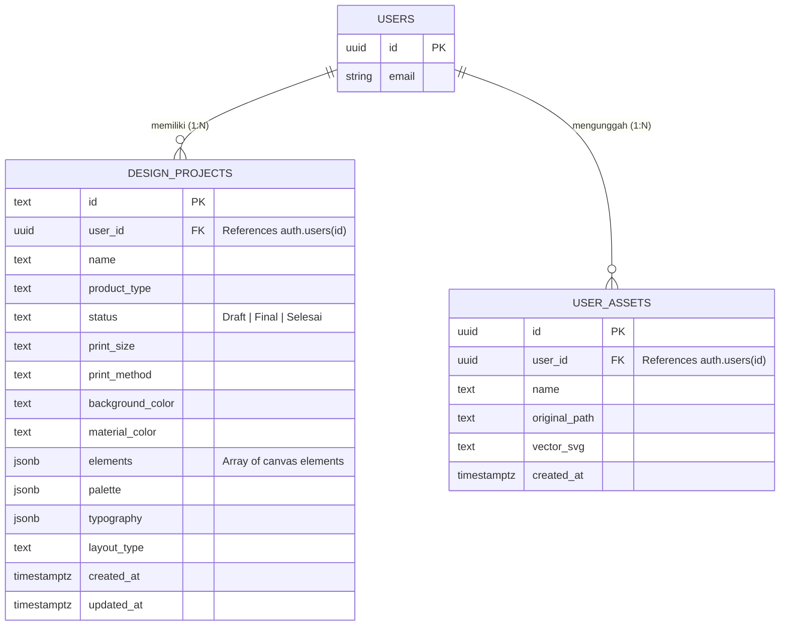

# Draft Materi Laporan Tugas Akhir (D3)
**Topik:** Aplikasi *Web-to-Print* (SaaS) Editor Desain Sampul Rapor Berbasis Canvas API dan Gemini AI.

Dokumen ini berisi informasi teknis, arsitektur, skema database, dan rincian fitur secara mendalam yang siap disalin dan disesuaikan ke dalam format Laporan Tugas Akhir (Bab I hingga Bab IV) Anda.

---

## BAB I: PENDAHULUAN

### 1.1 Latar Belakang
Industri percetakan konvensional dalam memproduksi sampul rapor sekolah masih mengandalkan perangkat lunak desain berat berbasis *desktop* (seperti CorelDRAW atau Adobe Illustrator). Proses ini memaksa pihak percetakan untuk melakukan desain tata letak (*layouting*) secara manual berulang-ulang untuk setiap sekolah, yang memakan waktu lama dan rentan terhadap kesalahan teknis (seperti teks yang tertutup jendela "mika nama" fisik pada rapor).

Untuk mengatasi masalah tersebut, dikembangkan sebuah perangkat lunak berbasis web (*Software as a Service / SaaS*) bernama **Web-to-Print Editor**. Sistem ini mendigitalisasi dan mengotomatiskan proses penyusunan desain menggunakan teknologi Kecerdasan Buatan (AI) dari Google Gemini, di mana klien atau operator percetakan dapat menghasilkan tata letak proporsional dalam hitungan detik. Aplikasi ini juga menghadirkan antarmuka *Vector Editor* bergaya klasik namun berbasis web, lengkap dengan pratinjau fisik 3D secara *real-time*, sehingga menekan siklus revisi dan mempercepat proses pra-cetak.

### 1.2 Rumusan Masalah
1. Bagaimana merancang dan membangun editor vektor berbasis web yang ringan untuk mengatur tata letak cetak rapor?
2. Bagaimana mengintegrasikan AI generatif untuk merancang tata letak (koordinat dan hierarki font) secara otomatis berdasarkan parameter teks input?
3. Bagaimana mengimplementasikan sistem batasan (*constraint*) koordinat agar desain tidak menabrak batas jendela mika (plastik transparan) pada rapor?

### 1.3 Tujuan
Membangun platform *Web-to-Print* yang menyederhanakan proses desain rapor sekolah dengan fitur otomatisasi tata letak (AI), editor interaktif berbasis web, sistem manajemen proyek, dan pratinjau produk dalam format 3D.

---

## BAB II: TEKNOLOGI YANG DIGUNAKAN (*TECH STACK*)

Sistem dibangun menggunakan pendekatan pengembangan *Full-Stack Web Development* modern:
1. **Front-End & Framework Utama:** `React.js` dan `Next.js` (App Router). Memungkinkan rendering komponen yang cepat, *routing* sisi klien, dan performa tinggi untuk mengelola state Canvas Editor.
2. **Styling & UI:** `Vanilla CSS` dan `Tailwind CSS`. Desain dibuat secara *custom* dengan CSS murni dipadukan dengan utilitas Tailwind untuk meniru pengalaman pengguna (UX) klasik khas perangkat lunak desktop (CorelDRAW X7 era). Animasi mikronya menggunakan framework `framer-motion`.
3. **Back-End API:** `Next.js API Routes` (Serverless). Digunakan untuk menghubungkan aplikasi dengan layanan AI dan manipulasi data pihak ketiga.
4. **Basis Data & Autentikasi:** `Supabase` (PostgreSQL). Menggunakan layanan *Backend-as-a-Service* (BaaS) ini untuk autentikasi (Login/Register), manajemen *Row Level Security* (RLS), dan penyimpanan data JSON.
5. **Kecerdasan Buatan (AI):** `Google Gemini API` (Model *gemini-3.5-flash*). Digunakan untuk menganalisis teks input dan menghasilkan JSON array berisi objek kanvas (*x, y, fontSize*) yang presisi.

---

## BAB III: ANALISIS DAN PERANCANGAN SISTEM

### 3.1 Arsitektur Sistem
Aplikasi memisahkan layer *Client* dan *Server*:
1. **Client Layer:** User mengakses halaman melalui browser. Tersedia tampilan Dashboard, Create Project Form, Editor Page, dan Preview 3D.
2. **API Layer:** Saat AI di-request, Client menembak `/api/gemini`. Saat menyimpan proyek, Client memanggil fungsi Supabase Client SDK secara asinkronus.
3. **Database Layer:** Supabase DB (PostgreSQL) menerima dan menyimpan JSON array dari bentuk-bentuk geometri dan teks.

### 3.2 Skema Database (PostgreSQL)

Sistem menggunakan 2 (dua) tabel utama untuk menyimpan data terstruktur. Berikut adalah visualisasi *Entity Relationship Diagram* (ERD) dari relasi antar entitas:



#### Tabel 1: `design_projects`
Menyimpan informasi inti dari sebuah proyek desain rapor yang sedang dikerjakan. Data elemen *canvas* disimpan dengan tipe data `JSONB` agar dinamis.

```sql
create table if not exists public.design_projects (
  id              text        primary key,
  user_id         uuid        not null references auth.users(id) on delete cascade,
  name            text        not null,
  product_type    text        not null default 'Sampul Rapor',
  category        text        not null default '',
  concept         text        not null default '',
  audience        text        not null default '',
  slogan          text        not null default '',
  description     text        not null default '',
  status          text        not null default 'Draft' check (status in ('Draft', 'Final', 'Selesai')),
  background_color text       not null default '#1E3A8A',
  elements        jsonb       not null default '[]'::jsonb,
  palette         jsonb       null,
  typography      jsonb       null,
  layout_type     text        null,
  created_at      timestamptz not null default now(),
  updated_at      timestamptz not null default now()
);

-- Indexing & RLS Policies (Row Level Security)
create index idx_design_projects_user_id on public.design_projects(user_id);
alter table public.design_projects enable row level security;
-- (Setiap policy membatasi aksi SELECT, INSERT, UPDATE, DELETE hanya untuk user_id miliknya)
```

#### Tabel 2: `user_assets`
Digunakan untuk menampung *asset* gambar/logo kustom yang diunggah (*import*) oleh pengguna ke dalam editor. Gambar diubah ke *Vector B&W* (`vector_svg`) demi kebutuhan cetak embos foil.

```sql
create table if not exists public.user_assets (
  id              uuid        primary key default gen_random_uuid(),
  user_id         uuid        not null references auth.users(id) on delete cascade,
  name            text        not null default 'Untitled Asset',
  original_path   text        null,
  vector_svg      text        not null,
  created_at      timestamptz not null default now()
);

-- Indexing & RLS Policies
create index idx_user_assets_user_id on public.user_assets(user_id);
alter table public.user_assets enable row level security;
```

### 3.3 Rule/Aturan Bisnis (*Business Logic Constraint*)
- **Zona Terlarang Mika Nama:** Pada rentang koordinat `Y = 50` hingga `Y = 80`, sistem memblokir semua interaksi drop elemen jenis `text`. Hal ini dirancang di level *event mouse drag* dan API *prompting* AI agar tulisan tidak tercetak di bawah jendela plastik transparan (mika).

---

## BAB IV: IMPLEMENTASI DAN DETAIL FITUR

Berikut ini adalah fitur-fitur kompleks yang berjalan di dalam aplikasi:

### 1. Pembangkit Tata Letak Berbasis AI (AI Auto-Layout)
* **Deskripsi:** Pengguna yang tidak paham desain dapat mengetik teks (Judul, Nama Sekolah, Alamat) di dalam form. Aplikasi mengirim *prompting* dengan *System Instruction* ketat ke Google Gemini.
* **Cara Kerja:** AI menerima konstrain ukuran font berjenjang (`43pt, 33pt, 23pt, 13pt`), warna default (*#D4AF37 / Emas*), dan aturan zona terlarang Mika. AI kemudian mengembalikan array JSON berisikan koordinat matematis X dan Y untuk setiap baris teks, sehingga teks langsung tersusun estetis saat editor terbuka.

### 2. Editor Vektor Interaktif (Sistem Gembok Koordinat)
* **Deskripsi:** Layar kerja utama aplikasi yang menyerupai perangkat lunak *desktop*.
* **Fitur Gembok Horizontal (*isLockedX*):** Semua elemen secara *default* akan dikunci di posisi rata tengah secara matematis (`X = 50 - width/2`). Saat user melakukan *drag-and-drop* atau menekan Panah Kanan/Kiri pada keyboard, elemen tersebut hanya akan meluncur secara vertikal (sumbu Y). Untuk menggerakkannya bebas, user harus menekan tombol UI **"Buka Gembok"** di panel *Properties*.
* **Manajemen State (Undo/Redo):** Menggunakan hook kustom `useCallback` dan state `history[]` yang merekam setiap perubahan JSON `elements` (maksimal 50 langkah mundur).

### 3. Fitur *Image Tracing* dan Pembatasan Skala
* **Import Cerdas:** Pengguna dapat men-*drag* file gambar JPG/PNG ke layar. Skrip *FileReader* menangkapnya, dan mencegah gambar menutupi kanvas dengan mengatur konstrain otomatis maksimal `width = 30%` sambil mempertahankan *aspect ratio* aslinya (*tidak gepeng*).
* **Tracing ke Vektor B&W:** Menggunakan algoritma *thresholding* sisi peramban (atau pustaka kanvas 2D), di mana gambar diubah menjadi monokrom (*hitam putih padat*) demi kebutuhan cetak *Sablon* atau pelat logam *Embos Foil*.

### 4. Pratinjau Tiga Dimensi (3D Mockup)
* **Deskripsi:** Bukan sekadar rendering datar. Menggunakan manipulasi CSS 3D Transforms (`perspective`, `rotateX`, `rotateY`, dan `translateZ`) berpadu dengan sensor posisi kursor (*mouse movement parallax effect*).
* **Realistis:** Rendering *background* JSON ditempel (overlay) dengan *opacity blend mode* ke atas sebuah gambar tekstur ASE (bahan pelapis kaku). Ditambahkan efek pantulan linier (*linear-gradient glare*) yang bergerak seiring putaran 3D untuk mensimulasikan material *gold foil* mengkilap. Area "mika" dihiasi aset `.png` sungguhan agar klien (sekolah) memahami wujud fisik hasil jadinya.
